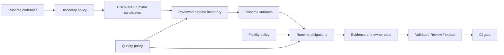
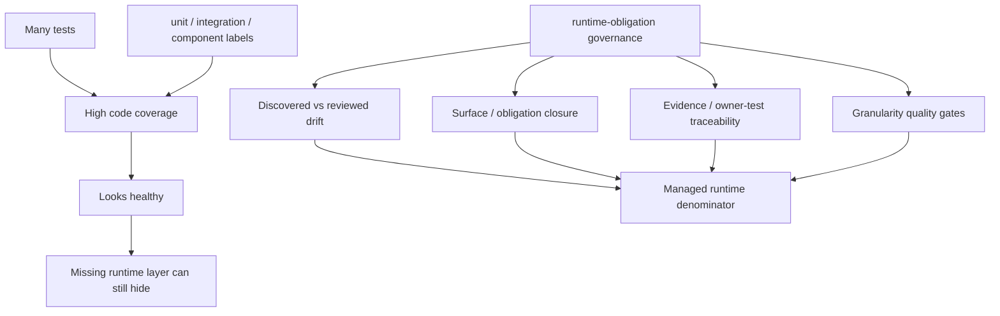
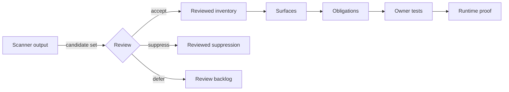
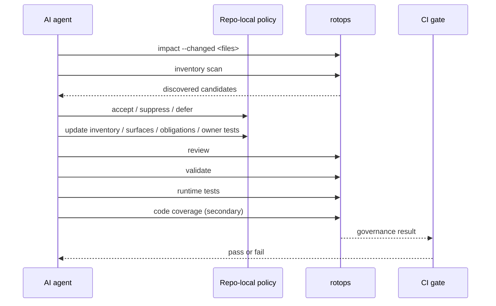

# runtime-obligation-testops

`runtime-obligation-testops` is a TestOps control system for teams that want automated testing managed against real runtime behavior, not just test labels or line coverage.

The package exists for one governing rule:

`automated testing is managed against the full set of runtime obligations`

That rule is enforced through four properties:

- `event completeness`
- `outcome closure`
- `observability`
- `traceability`

## Why this exists

This project started from a real failure mode in a real product.

The original product had:

- a large automated test suite
- very high code coverage
- passing builds
- clear `unit / integration / component` labels

and still had missing runtime layers.

The core problem was not that the product had too few tests.
The problem was that the product had no durable way to answer:

- what the real runtime denominator is
- which runtime layers are actually managed
- what observable outcomes are proven
- which tests own that proof
- whether the denominator has been silently narrowed by hand

In practice that caused exactly the kind of mistake this package is designed to prevent:

- a repo can look “100% covered”
- a declared control plane can look clean
- and a whole runtime layer can still be absent from the managed denominator

That is why this package exists.

It is not a prettier coverage tool.
It is a control system for the runtime denominator itself.

## Runtime governance model



The package governs that graph.
Not just the tests at the bottom of it.

## Who decides what

This package is not designed around manual test bookkeeping.
It is designed around a reviewed operating loop:

- the scanner proposes candidates
- repo-local policy shapes how those candidates should be interpreted
- AI agents do most of the inventory, surface, obligation, annotation, and owner-test maintenance
- reviewers approve semantic decisions when acceptance, suppression, fidelity, or granularity is non-obvious
- CI enforces the resulting governance gates

That distinction matters.
If you describe this package as just a validator, people will use it too late in the workflow.

## What problem it solves

Most repos can tell you:

- how many tests exist
- which folders contain tests
- which runner they use
- what line coverage says

Most repos cannot tell you:

- which runtime events define the real denominator
- which surfaces partition that denominator
- which obligations close those surfaces
- what evidence proves each obligation
- which tests own that evidence
- whether discovery and the reviewed model have drifted apart

This package makes those questions explicit and operational.

It also handles a second failure mode that appears after teams adopt a reviewed model:

- the reviewed model exists
- validation is green
- but one inventory source or one obligation is so broad that real test gaps still hide inside it

`runtime-quality-policy.json` exists to make that reviewed-model smell explicit instead of letting it live behind a green control plane.

## Why line coverage is not enough



## What the package actually manages

The package manages six connected artifacts:

- `runtime-discovery-policy.json`
  - scanner rules, ignore patterns, reviewed suppressions
- `runtime-inventory.json`
  - the reviewed runtime denominator
- `runtime-surfaces.json`
  - the project-specific management partition over that denominator
- `runtime-control-plane.json`
  - obligations, evidence, fidelity, owner tests
- `fidelity-policy.json`
  - the minimum proof strength required by surface, source, or obligation
- `runtime-quality-policy.json`
  - reviewed-model quality gates that flag overly broad sources or obligations

The first artifact manages discovery.
The next four artifacts are the reviewed runtime model.
The final artifact governs whether that reviewed model is still granular enough to trust.

## Universal core, repo-local policy

This package is intentionally split into two layers:

- a universal control core
- repo-local operating policy

The universal core gives every project the same runtime-governance model:

- sources
- surfaces
- obligations
- outcomes
- evidence
- fidelity
- owner tests
- traceability

Repo-local policy tells the core how this specific codebase should be interpreted:

- which files are even eligible for discovery
- which generated or vendor paths must be ignored
- which candidate matches are reviewed suppressions
- which runtime categories need explicit source overrides
- whether discovered-vs-reviewed drift should fail CI now or only warn

That split matters.
It lets the package stay universal without pretending that every codebase emits the same scanner signals.

## Discovered vs reviewed



## The key design choice: discovered vs reviewed

The package keeps two layers of truth in tension:

- `discovered runtime candidates`
- `reviewed runtime model`

That distinction is the whole point.

If you manage only the reviewed model, teams can accidentally leave real runtime files out of scope.
If you trust only discovery, you get noisy heuristics instead of an operable system.

`rotops validate` exists to stop those two layers from drifting apart silently.

## Who does what in practice

| Actor | Primary job | What it should not do |
|---|---|---|
| Discovery engine | Propose runtime candidates and drift | Declare truth by itself |
| Repo-local policy | Teach the scanner how this repo expresses runtime | Hide real runtime files just to get green output |
| AI agent | Perform most model, annotation, and owner-test updates | Stop at line coverage or raw test counts |
| Reviewer | Approve semantic decisions | Rebuild the whole model manually every time |
| CI | Enforce governance gates | Replace semantic review |

## What is universal and what is heuristic

The package is strongest at the control layer:

- `validate`
- `impact`
- the reviewed runtime model
- fidelity policy
- quality policy
- owner-test traceability

Discovery is intentionally a bootstrap engine, not an oracle.

That means:

- the package can be used in repos that do not look like the example repo
- teams can start with a hand-authored reviewed model
- discovery can begin in advisory mode
- repo-local policy can gradually tighten discovery quality over time

This is the intended operating model.
The package is not promising that raw scanner output is universally correct on day one.

## Where this fits in a real test strategy

This package is for governing automated verification below and around the top black-box layer.

It helps teams manage:

- request boundaries
- client state transitions
- workflow orchestration
- persistence semantics
- background execution
- external contracts
- runtime invariants

It does not eliminate the need for:

- real-dependency integration tests
- full-system tests
- browser or manual black-box checks

Those layers still matter.
This package exists so the rest of the automated stack is not managed blindly.

## What this is not

It is not:

- a replacement for your test runner
- a replacement for E2E or manual testing
- an oracle that invents the correct runtime model without review
- a promise that line coverage now means runtime completeness

It is a control system for keeping your runtime denominator, proof graph, and test ownership aligned.

## Commands

Install the package in the target repo first:

```bash
npm install -D runtime-obligation-testops
```

Then run the CLI:

```bash
npx rotops init
npx rotops inventory scan
npx rotops surfaces derive
npx rotops review
npx rotops validate
npx rotops report
npx rotops impact --changed src/path/to/file.ts
npx rotops export agent-contract
npx rotops export vitest-workspace --out vitest.runtime.workspace.ts
```

If your repo wraps `rotops` behind project-local scripts, export the agent contract with those commands:

```bash
npx rotops export agent-contract \
  --review-command "npm run test:review" \
  --impact-command "npm run test:impact -- --changed <path>" \
  --validate-command "npm run test:control"
```

If your repo uses non-default paths such as `testing/` instead of `testops/`, keep the artifacts where they are and wrap the CLI with project-local scripts.

## Reviewed-model quality

`runtime-quality-policy.json` is the package's guard against a green-but-coarse reviewed model.

It can express rules such as:

- maximum files per reviewed inventory source
- maximum files per obligation
- maximum reviewed inventory sources per obligation

Fidelity policy governs proof strength.
Quality policy governs proof granularity.

## Recommended bootstrap strategy

Do not assume every repo should start in strict discovery mode.

The safe sequence is:

1. start with a reviewed model for one important runtime slice
2. keep discovery scoped to the slice you actually intend to manage first
3. use `rotops validate` and `rotops impact` as the first CI gate
4. use `rotops review` to keep discovered candidates visible while repo-local policy is still being shaped
5. move discovery drift to `error` once the scanner is trustworthy for that repo

That rollout works better than pretending heuristics are already perfect.

## Agent operating loop



## Recommended operating loop

1. Run `inventory scan` to discover candidate runtime sources.
2. Run `review` to turn scanner output into an explicit review backlog.
3. Record suppressions, scope decisions, and scanner noise in `runtime-discovery-policy.json`.
4. Accept the reviewed denominator in `runtime-inventory.json`.
5. Derive or refine runtime surfaces in `runtime-surfaces.json`.
6. Register obligations, evidence, fidelity, and owner tests in `runtime-control-plane.json`.
7. Export the machine-readable agent contract for local tooling or CI.
8. Run `validate` before the main test suite.

## What `validate` checks

- artifact schemas are valid
- principles are consistent across artifacts
- reviewed inventory sources map to reviewed surfaces
- reviewed surfaces map to the control plane
- reviewed runtime files are closed by obligations
- owner tests exist and are referenced
- `// runtime-obligations: ...` annotations do not drift
- fidelity does not regress below policy
- discovered runtime files are not missing from the reviewed denominator

## AI operating model

This package is designed for AI coding agents as much as for humans.

The expected loop is:

1. detect changed runtime files
2. run `rotops impact`
3. run `rotops review` when denominator drift may have changed
4. compare discovered candidates to the reviewed model
5. accept, suppress, or continue reviewing candidate drift through repo-local policy
6. update obligations and owner tests
7. export or refresh the machine-readable runtime agent contract when project paths or process changed
8. rerun `rotops validate`

The control system exists so an agent cannot “solve” testing by only adding lines of test code.
The agent has to maintain the runtime model too.

## How to use this in practice

Use it when you want a repo to answer, concretely:

- what runtime behavior exists
- what part of it is managed
- what part is still unreviewed
- what proof exists
- what proof is too weak
- what changed files affect which obligations

Do not use it as a cosmetic wrapper around existing folder labels.
If the runtime denominator is not reviewed, the system is being used incorrectly.

## Bootstrap maturity

Different parts of the package mature at different speeds in different stacks.

- control plane validation is generally portable
- impact analysis is generally portable
- reviewed-model governance is generally portable
- raw discovery quality depends on repo-local policy and codebase signals

That is why this package exposes policy files instead of hiding heuristics inside the binary.

## Public repo readiness

A repo using this package is publishable when:

- new runtime entrypoints cannot land without denominator review
- discovered-vs-declared drift fails CI
- obligations own tests and annotations
- proof strength is visible through fidelity policy
- humans and AI agents read the same artifacts first

## AI agents

An AI agent should not treat the control plane as documentation.
It should treat it as the runtime source of truth for automated testing changes.

Start here:

- [Why This Exists](./docs/why-this-exists.md)
- [Principles](./docs/principles.md)
- [Runtime Model](./docs/model.md)
- [Adoption Guide](./docs/adoption.md)
- [Repo-Local Policy](./docs/repo-local-policy.md)
- [Bootstrap Maturity](./docs/bootstrap-maturity.md)
- [Completeness Workflow](./docs/completeness-workflow.md)
- [AI Agent Integration](./docs/ai-agent-integration.md)

## Example

The package includes a concrete product example under [examples/apppulse](./examples/apppulse).

It also includes a smaller staged-adoption example for a non-JS runtime slice under [examples/flutter-session](./examples/flutter-session).

That example matters because this package was not invented from a blank framework template.
It was extracted from a real product that exposed the exact failure mode this system is meant to prevent.

## License

MIT
