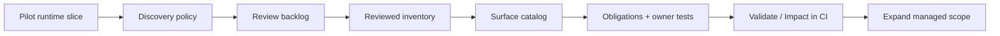
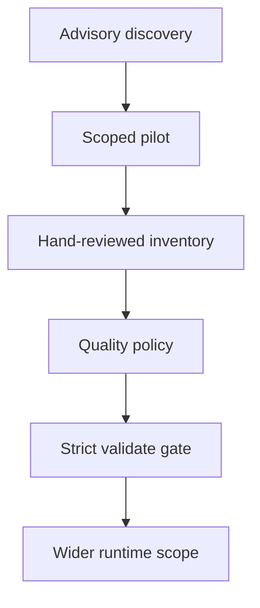

# Adoption Guide

## Start from the runtime, not the repo layout

Do not begin with:

- `unit / integration / component`
- package folders
- line coverage

Begin with what can actually happen at runtime:

- request entrypoints
- UI entrypoints
- storage boundaries
- background execution
- external adapters
- session and auth boundaries

The point of adoption is not to rename tests.
The point is to make the runtime denominator explicit and governable.

## Adoption map



## When this package is worth adopting

Adopt it when a repo already has meaningful automation, but still struggles to answer:

- what the real runtime denominator is
- whether a runtime layer is missing from review
- which tests actually own important behavior
- which behavior units are only covered by weak proof

If your team only wants a prettier test folder structure, this package is the wrong tool.

## The adoption sequence

### 1. Decide how strict discovery should be initially

Set `runtime-discovery-policy.json` first.

In many repos, the right initial setting is:

- `candidateReviewMode: "warning"`
- narrow `scopePatterns` for the first managed slice
- explicit `ignorePatterns` for generated or vendored paths
- targeted `sourceOverrides` for categories the generic scanner cannot infer well yet

Strict discovery is a rollout goal, not a prerequisite.

### 2. Discover candidate runtime sources

```bash
npx rotops inventory scan
```

This gives you the first draft of the denominator.
It is intentionally heuristic.

### 3. Review scanner noise

Turn raw scanner output into a review queue:

```bash
npx rotops review
```

Use `runtime-discovery-policy.json` to:

- ignore generated or irrelevant files
- suppress reviewed false positives
- narrow discovery scope while adoption is still intentionally partial
- override runtime categories with repo-local include or exclude patterns
- keep CI stable

Do not edit the reviewed denominator just to make validation look clean.
Review discovery first.

The discovery layer exists to challenge the reviewed model, not to be rewritten away.

### 4. Declare the reviewed denominator

Move accepted runtime sources into `runtime-inventory.json`.

This file is the denominator your team is willing to manage.
If the denominator is wrong, every downstream clean-looking signal is weaker than it looks.

### 5. Derive management surfaces

```bash
npx rotops surfaces derive
```

Then refine the result.

Good surfaces are:

- meaningful for your runtime
- stable enough to operate
- non-overlapping enough to stay understandable
- complete enough to cover the reviewed denominator

There is no package-level fixed list.
Surfaces are project-specific management partitions.

### 6. Register reviewed behaviors and behavior units

For each surface, define behavior units with:

- event
- outcomes
- evidence
- fidelity
- owner tests

### 7. Add reviewed-model quality policy

Define `runtime-quality-policy.json` once the reviewed model is large enough that coarse sources or behavior units could hide gaps.

Typical first rules:

- maximum files per reviewed inventory source
- maximum files per behavior unit
- maximum reviewed inventory sources per behavior unit
- maximum reviewed inventory behaviors per behavior unit

Start with warnings if needed.
Promote high-risk surfaces to errors when the model is stable enough.

### 8. Connect the proof

Annotate owner tests:

```ts
// runtime-behaviors: surface.example-behavior
```

If a test owns no reviewed behavior, it should not be presented as runtime proof.

### 9. Add the control gate to CI

Run:

```bash
npx rotops validate
```

before the main test suite.

Treat `validate` failures as control-plane regressions, not as incidental tooling noise.
When discovery is still advisory, warnings should still be reviewed even if they do not fail CI yet.

If your repo uses AI agents heavily, export the machine-readable contract as part of the control loop:

```bash
npx rotops export agent-contract
```

That contract is not the source of truth by itself.
It is the generated operational view that tells agents which artifacts to read first and which commands are non-negotiable.

## Staged strictness



## What a good rollout looks like

At the end of adoption, your repo should be able to answer:

- what the runtime denominator is
- which surfaces partition it
- which reviewed behaviors define it
- which behavior units implement it
- what evidence proves each implemented behavior
- which tests own that proof
- whether discovered runtime files are missing from the reviewed model

It should also be able to reject this failure mode:

- high coverage
- many tests
- clean CI output
- but no proof that the full runtime denominator is governed

## Public repo checklist

- commit the six runtime artifacts
- commit `AGENTS.md`
- fail CI on `rotops validate`
- keep generated reports out of git
- document any non-default path layout
- make example owner-test annotations visible in the repo

## Existing repos with custom paths

If your repo already uses `testing/` instead of `testops/`, keep the artifacts where they are and wrap `rotops` with project-local scripts.

The rule is consistency, not folder dogma.
